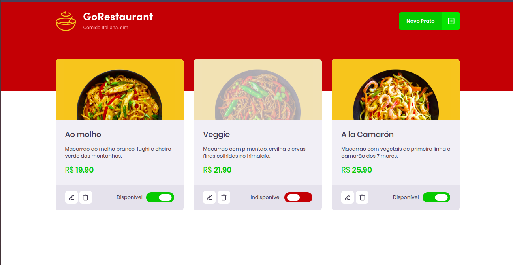

# template-gorestaurant

## Project description

This project is GoRestaurant, which was developed to improve the concepts of ReactJS together with Typescript. This project also includes the CRUD (Create, Read, Update, Delete) concept.

## Template

## Functionalities

* In this project the user is able to insert a new food by clicking on the new dish button. When clicking on the button, a modal will appear to insert the necessary information;

* The user is able to update a food;

* The user is able to delete a food;

